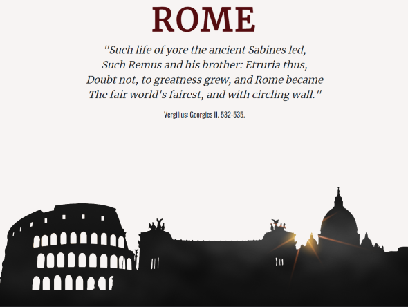
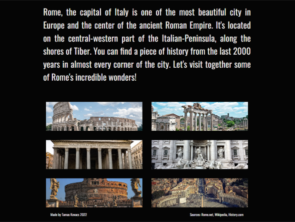

# Rome sights

**Check it live [here](https://romexpress.vercel.app/)!**

## About

This website is rendered from `ejs` templates from an Express server. 
It's about Rome and some of it's famous sights, such as the *Colosseum*, *Forum Romanum* or the *Pantheon*.
The content of the page are from the [pixabay](https://pixabay.com/), [rome.net](https://www.rome.net), [wikipedia](https://www.wikipedia.com), [history.com](https://www.history.com). 

## Screenshots

**Homepage**

**Homepage**

**Sight page**

## Sources

- [Express](https://expressjs.com/)
- [EJS](https://ejs.co/)
- [Helmet](https://helmetjs.github.io/)
- [CORS](https://www.npmjs.com/package/cors)
- [Bootstrap](https://getbootstrap.com/)
- [Vercel](https://vercel.com/)
- [GoogleFonts](https://fonts.google.com/knowledge)